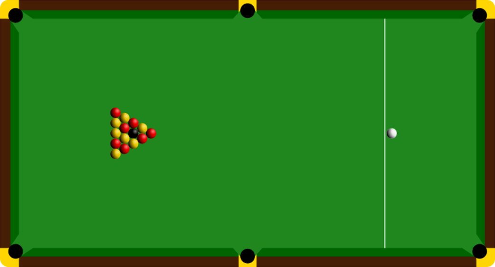
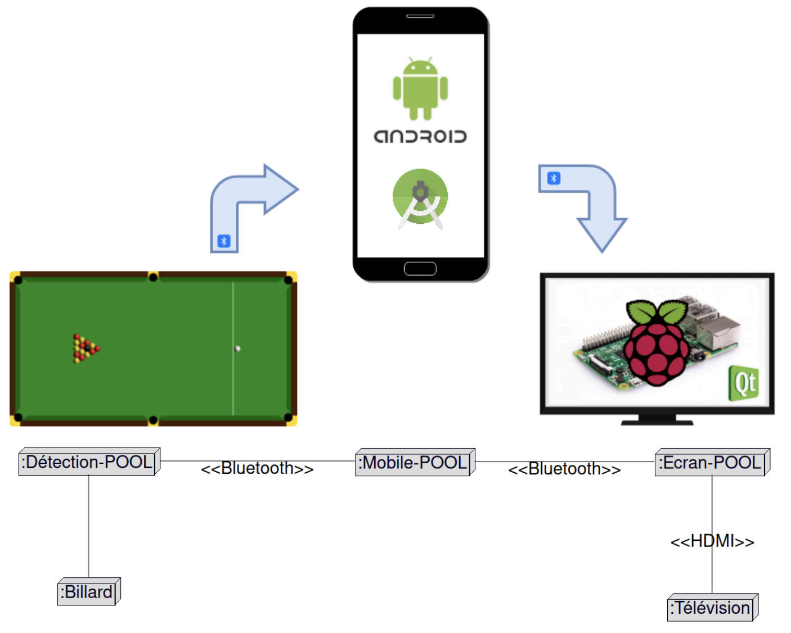
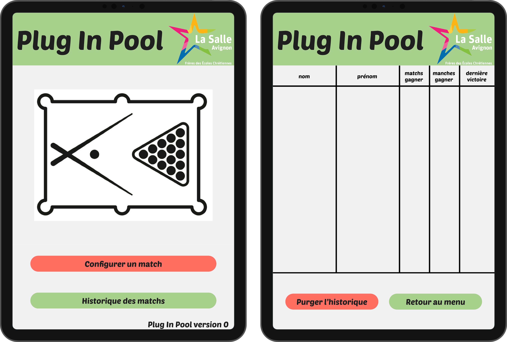
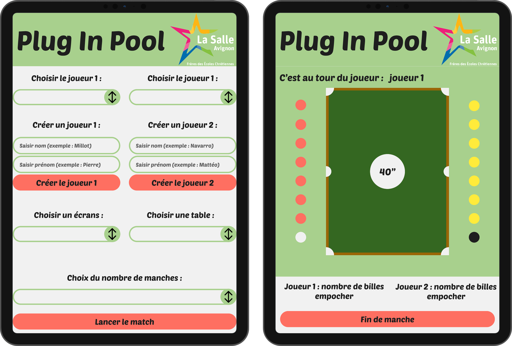
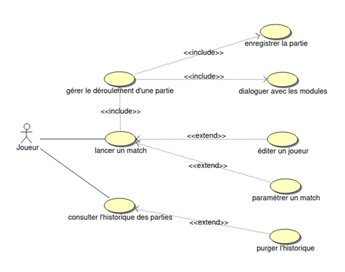
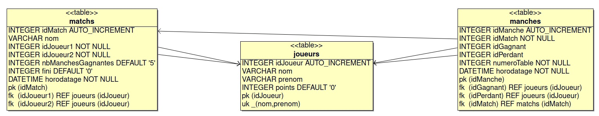
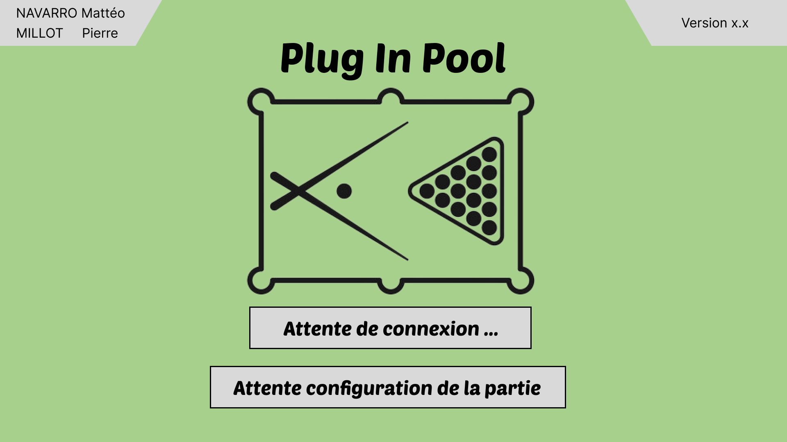
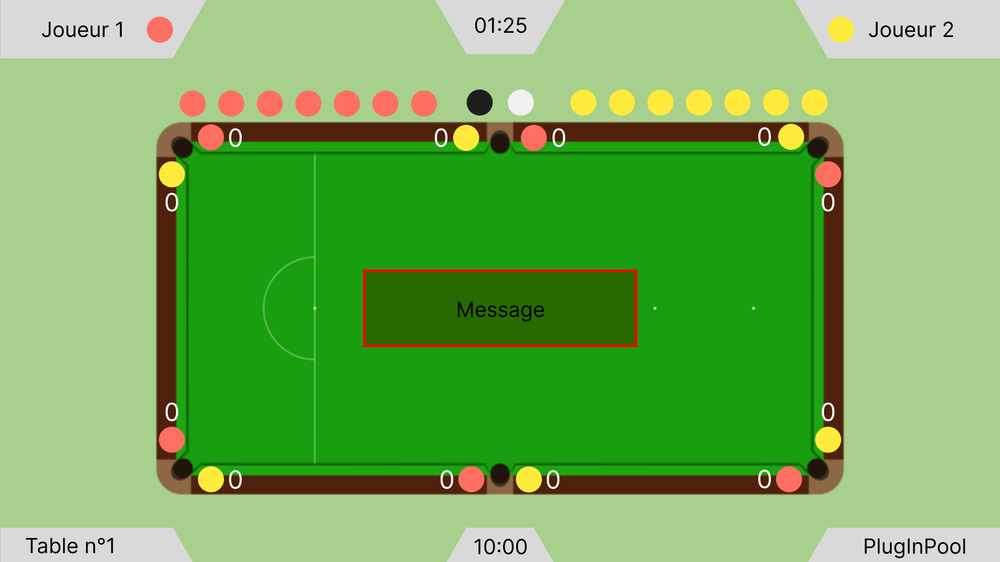
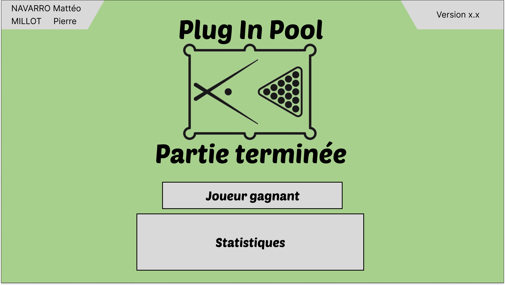

<table>
    <tr>
        <th colspan="3">Plug-in-pool</th>
    </tr>
    <tr>
        <td>
        
        </td>
        <td>
        
        </td>
        <td>
        
        </td>
    </tr>
</table>

# plug-in-pool-2025
- [Projet : Plug In Pool](#plug-in-pool-2025)
  - [Présentation](#présentation)
  - [Déroulement d'une partie](#déroulement-dune-partie)
  - [Parties IR](#parties-ir)
    - [Application Android](#application-android)
      - [Module de gestion de partie](#module-de-gestion-de-partie)
      - [Maquette de l'application Android](#maquette-de-lapplication-android)
      - [Recette](#recette)
      - [Diagramme de cas d'utilisation Android](#diagramme-de-cas-dutilisation-android)
      - [Base de données](#base-de-données)
    - [Application Qt](#application-qt)
      - [Module de visualisation de partie](#module-de-visualisation-de-partie)
      - [Maquette de l'application Qt](#maquette-de-lapplication-qt)
      - [Recette](#recette)
  - [Itérations](#itérations)
    - [Itération 1](#itération-1)
    - [Itération 2](#itération-2)
    - [Itération 3](#itération-3)
    - [Itération 4](#itération-4)
  - [Changelog](#changelog)
  - [TODO](#todo)
  - [Défauts constatés non corrigés](#défauts-constatés-non-corrigés)
  - [Équipe de développement](#équipe-de-développement)

---

## Présentation

Le système **Plug in Pool** est un système numérique permettant de jouer une partie
de blackball (parfois appelé billard anglais, billard pool ou 8 pool).
Les rencontres (matchs) sont réalisées en n parties (ou manches) gagnantes.

Le blackball est un jeu de billard qui se déroule sur une table rectangulaire à 6 poches avec 14 billes de couleur (7 rouges et 7 jaunes), une bille noire portant le numéro 8 et une bille d'impact blanche. Les joueurs jouent uniquement les billes de leur groupe : les jaunes ou les rouges. Si un joueur empoche une de ses billes, il est autorisé à rejouer. La partie est gagnée par le joueur (ou l’équipe) qui, après avoir empoché les 7 billes de sa couleur, empoche la bille noire numéro 8.
([voir déroulement d'une partie](#déroulement-dune-partie))

Chaque table de billard est équipée de capteurs permettant de détecter dans quelle poche une bille a été empochée ainsi que sa couleur.
Ensuite, afin que ces données recueillies par les capteurs soient transmises à un appareil Android pour la gestion de la partie, un module Bluetooth sera utilisé pour assurer la transmission des informations entre la table et la tablette, dans les deux sens.

---

## Déroulement d'une partie

---
## Parties IR

### Application Android

#### Module de gestion de partie

Sur le terminal mobile Android, l'application permet de paramétrer et démarrer une partie.  
Ainsi, les joueurs peuvent :

- Saisir leur nom
- Paramétrer la rencontre
  - Saisir le nombre de manches gagnantes
- Connecter le terminal mobile Android à une table
- Lancer la rencontre
- Gérer et visualiser le déroulement de la rencontre
  - Changer automatiquement de joueur
  - Afficher le nombre de points

Le terminal mobile Android, stocke chaque partie dans une base de données SQLite, où il est possible pour l'utilisateur en se rendant dans l'historique, de le visualisé ou le purgé. Le terminal Android permet de se connecter avec à une table par liaison Bluetooth pour communiquer avec elle, mais aussi pour assurer une liaison avec l'écrans d'affichage.

#### Maquette de l'application Android

#### Recette

<table>
  <tr>
    <td style="font-weight: bold;">Fonctionalités</td>
    <td style="font-weight: bold;">A faire</td>
    <td style="font-weight: bold;">En cours</td>
    <td style="font-weight: bold;">Terminé</td>
  </tr>
  <tr>
    <td>Créer un joueur</td>
    <td style="text-align: center;">x</td>
    <td style="text-align: center;"></td>
    <td style="text-align: center;"></td>
  </tr>
  <tr>
    <td>Paraméter une rencontre</td>
    <td style="text-align: center;">x</td>
    <td style="text-align: center;"></td>
    <td style="text-align: center;"></td>
  </tr>
  <tr>
    <td>Lancer une rencontre</td>
    <td style="text-align: center;">x</td>
    <td style="text-align: center;"></td>
    <td style="text-align: center;"></td>
  </tr>
  <tr>
    <td>Gérer le déroulement d'une rencontre</td>
    <td style="text-align: center;">x</td>
    <td style="text-align: center;"></td>
    <td style="text-align: center;"></td>
  </tr>
  <tr>
    <td>Enregistrer les données des manches</td>
    <td style="text-align: center;">x</td>
    <td style="text-align: center;"></td>
    <td style="text-align: center;"></td>
  </tr>
    <tr>
    <td>Consulter l'historique des rencontres</td>
    <td style="text-align: center;">x</td>
    <td style="text-align: center;"></td>
    <td style="text-align: center;"></td>
  </tr>
    <tr>
    <td>Purger l'historique</td>
    <td style="text-align: center;">x</td>
    <td style="text-align: center;"></td>
    <td style="text-align: center;"></td>
  </tr>
    </tr>
    <tr>
    <td>Dialoguer avec les modules</td>
    <td style="text-align: center;">x</td>
    <td style="text-align: center;"></td>
    <td style="text-align: center;"></td>
  </tr>
</table>

#### Diagramme de cas d'utilisation Android

#### Base de données

---

### Application Qt

#### Module de visualisation de partie

Ce module correspond à la partie “affichage” du système. Il a pour objectifs de réaliser la récupération d’informations envoyées par le terminal mobile et l’affichage de la rencontre actuelle. Il communique en Bluetooth uniquement avec le terminal mobile Android.

Sur l'écran, les joueurs pourront visualiser en continu:
- Le nom des joueurs (si existant), la durée écoulée de la partie.
- Les billes empochées et restantes.
- Le nombre de manches gagnées par chaque joueur.
- Des statistiques.

#### Maquette de l'application Qt

#### Recette

<table>
  <tr>
    <td style="font-weight: bold;">Fonctionalités</td>
    <td style="font-weight: bold;">A faire</td>
    <td style="font-weight: bold;">En cours</td>
    <td style="font-weight: bold;">Terminé</td>
  </tr>
  <tr>
    <td>Afficher un écran d'accueil</td>
    <td style="text-align: center;">x</td>
    <td style="text-align: center;"></td>
    <td style="text-align: center;"></td>
  </tr>
  <tr>
    <td>Visualiser l’empochage d’une bille</td>
    <td style="text-align: center;">x</td>
    <td style="text-align: center;"></td>
    <td style="text-align: center;"></td>
  </tr>
  <tr>
    <td>Visualiser les données de la manche en temps réel</td>
    <td style="text-align: center;">x</td>
    <td style="text-align: center;"></td>
    <td style="text-align: center;"></td>
  </tr>
  <tr>
    <td>Visualiser les données de la rencontre</td>
    <td style="text-align: center;">x</td>
    <td style="text-align: center;"></td>
    <td style="text-align: center;"></td>
  </tr>
  <tr>
    <td>Dialoguer avec le terminal mobile</td>
    <td style="text-align: center;">x</td>
    <td style="text-align: center;"></td>
    <td style="text-align: center;"></td>
  </tr>
</table>

---

## Itérations

### Itération 1

> Du 29 Janvier 2025 au 28 Mars 2025

- [x] Créer les maquettes des interfaces
- [x] Initialiser le dépot
- [ ] Paramétrer une partie
- [ ] Afficher les données de la partie en cours

### Itération 2

> Du 29 Mars 2025 au 23 Mai 2025

- [ ] Liaison entre la table de billard et le terminal mobile Android
- [ ] Liaison entre le terminal mobile Android et l'ecran d'affichage

### Itération 3

> Du 24 Mars 2025 au 30 Mai 2025

### Itération 4

> Du 31 Mars 2025 au 15 Juin 2025

---

## Changelog

---

## TODO

---

## Défauts constatés non corrigés

---

## Équipe de développement

- MILLOT Pierre : [**[pierre(dot)millot(dot)pro(at)gmail(dot)com](mailto:pierre.millot.pro@gmail.com)**]
- NAVARRO Mattéo : [**[matteo(dot)navarro(dot)pro(at)gmail(dot)com](mailto:matteo.navarro.pro@gmail.com)**]
- VIVANCOS Evan : [**[evan(dot)vivancos(dot)pro(at)gmail(dot)com](mailto:evan.vivancos.pro@gmail.com)**]

---

&copy; 2024-2025 BTS LaSalle Avignon
