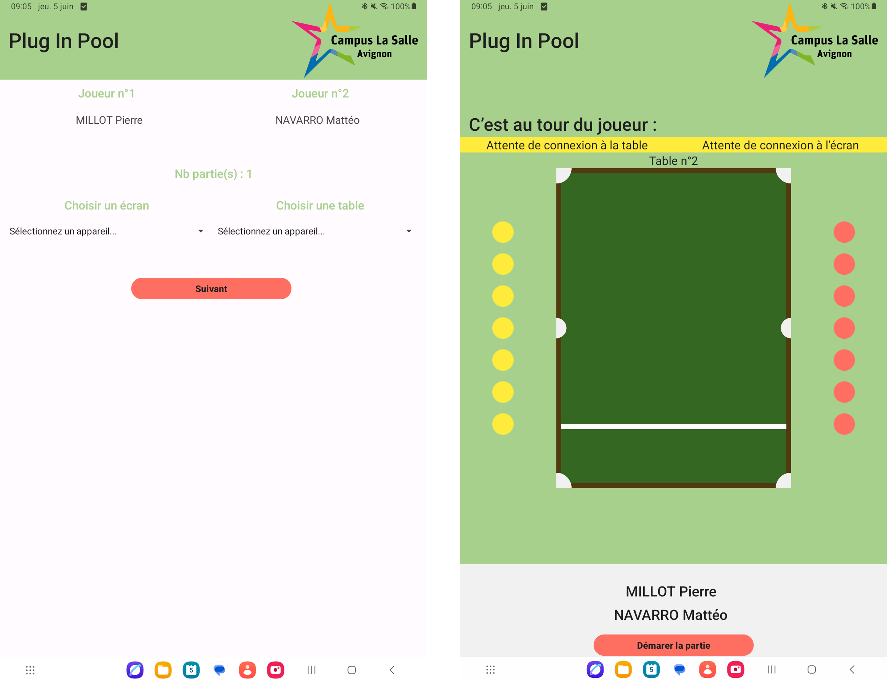
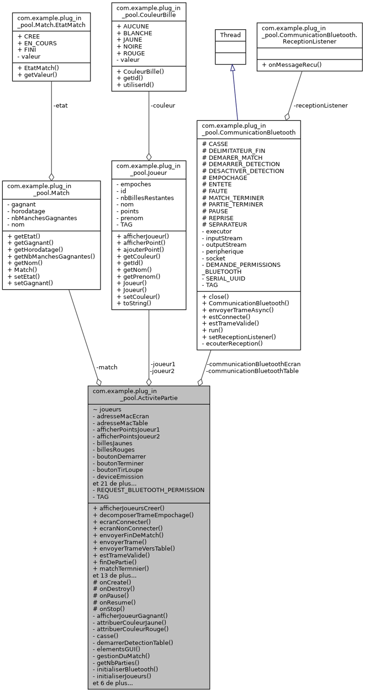
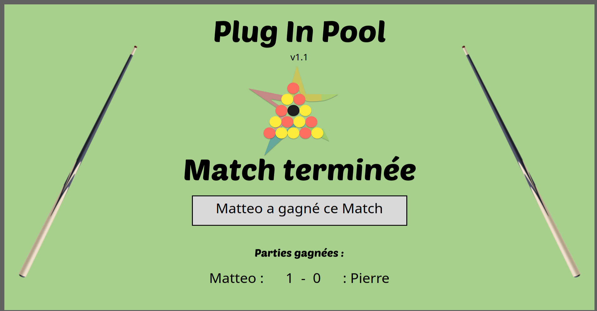
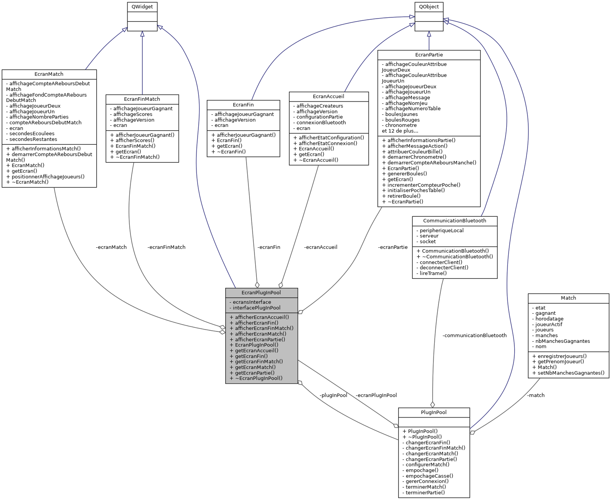

<table>
    <tr>
        <th colspan="3">Plug-In-Pool</th>
    </tr>
    <tr>
        <td>
        <a href="https://fr.wikipedia.org/wiki/Android"></a>
        </td>
        <td>
        <a href="https://fr.wikipedia.org/wiki/Qt"></a>
        </td>
        <td>
        <a href="https://github.com/bts-lasalle-avignon-projets/plug-in-pool-2025"></a>
        </td>
    </tr>
</table>

<table>
    <tr>
        <th colspan="2">GitHub Actions</th>
    </tr>
    <tr>
        <td>
        <a href="https://github.com/bts-lasalle-avignon-projets/plug-in-pool-2025/actions/workflows/qt-build.yml"></a>
        </td>
        <td>
        <a href="https://github.com/bts-lasalle-avignon-projets/plug-in-pool-2025/actions/workflows/android-build.yml"></a>
        </td>
    </tr>
</table>

# Projet BTS CIEL 2025 : Plug-In-Pool

- [Projet BTS CIEL 2025 : Plug-In-Pool](#projet-bts-ciel-2025--plug-in-pool)
  - [Présentation](#présentation)
  - [Modules IR](#modules-ir)
    - [Application Android](#application-android)
      - [Module de gestion de matchs](#module-de-gestion-de-matchs)
      - [Diagramme de cas d'utilisation (Android)](#diagramme-de-cas-dutilisation-android)
      - [IHM de l'application Android](#ihm-de-lapplication-android)
      - [Diagramme de classes (Android)](#diagramme-de-classes-android)
      - [Recette](#recette)
      - [Base de données](#base-de-données)
    - [Application Qt](#application-qt)
      - [Module de visualisation de matchs](#module-de-visualisation-de-matchs)
      - [Diagramme de cas d'utilisation (Qt)](#diagramme-de-cas-dutilisation-qt)
      - [IHM de l'application Qt](#ihm-de-lapplication-qt)
      - [Diagramme de classes (Qt)](#diagramme-de-classes-qt)
      - [Recette](#recette-1)
  - [Communication Bluetooth](#communication-bluetooth)
    - [Protocole](#protocole)
      - [Activation de la détection (Mobile → Table)](#activation-de-la-détection-mobile--table)
      - [Désactivation de la détection (Mobile → Table)](#désactivation-de-la-détection-mobile--table)
      - [Empochage (Table → Mobile)](#empochage-table--mobile)
      - [Démarrer un match (Mobile → Écran)](#démarrer-un-match-mobile--écran)
      - [Démarrer une partie : la casse (Mobile → Écran)](#démarrer-une-partie--la-casse-mobile--écran)
      - [Empochage (Mobile → Écran)](#empochage-mobile--écran)
      - [Faute (Mobile → Écran)](#faute-mobile--écran)
      - [Fin de partie (Mobile → Écran)](#fin-de-partie-mobile--écran)
      - [Pause (Mobile → Écran)](#pause-mobile--écran)
      - [Reprise (Mobile → Écran)](#reprise-mobile--écran)
      - [Abandon (Mobile → Écran)](#abandon-mobile--écran)
      - [Fin de match (Mobile → Écran)](#fin-de-match-mobile--écran)
  - [Gestion de projet](#gestion-de-projet)
    - [Itération 1](#itération-1)
    - [Itération 2 (version 0.1)](#itération-2-version-01)
    - [Itération 3 (version 1.0)](#itération-3-version-10)
    - [Itération 4 (version 1.1)](#itération-4-version-11)
  - [Changelog](#changelog)
    - [Version 1.0](#version-10)
    - [Version 0.1](#version-01)
  - [Défauts constatés non corrigés](#défauts-constatés-non-corrigés)
    - [Android](#android)
    - [Qt](#qt)
  - [Documentation du code](#documentation-du-code)
  - [Équipe de développement](#équipe-de-développement)

---

## Présentation

Le système **Plug in Pool** est un système numérique permettant de jouer un match de _blackball_ (parfois appelé billard anglais, billard pool ou 8 pool).

Les matchs sont réalisées en $n$ parties gagnantes.

Le _blackball_ est un jeu de billard qui se déroule sur une table rectangulaire à 6 poches avec 14 billes de couleur (7 rouges et 7 jaunes), une bille noire portant le numéro 8 et une bille d'impact blanche. Les joueurs jouent uniquement les billes de leur groupe : les jaunes ou les rouges. Si un joueur empoche une de ses billes, il est autorisé à rejouer. La partie est gagnée par le joueur (ou l’équipe) qui, après avoir empoché les 7 billes de sa couleur, empoche la bille noire numéro 8.

> voir [le déroulement d'une partie](#déroulement-dune-partie)


Chaque table de billard est équipée de capteurs permettant de détecter dans quelle poche une bille a été empochée ainsi que sa couleur.

Ensuite, afin que ces données recueillies par les capteurs soient transmises à un appareil Android pour la gestion de la partie, un module Bluetooth sera utilisé pour assurer la transmission des informations entre la table et la tablette, dans les deux sens.


---

## Modules IR

### Application Android

#### Module de gestion de matchs

Sur le terminal mobile Android, l'application permet de paramétrer un match et démarrer une ou plusieurs partie(s).

Ainsi, les joueurs peuvent :

- Saisir leur nom
- Paramétrer le match entre deux joueurs
  - Saisir le nombre de parties gagnantes
- Connecter le terminal mobile Android à une table
- Lancer le match
- Gérer et visualiser le déroulement de la partie
  - Changer automatiquement de joueur
  - Afficher le nombre de points

Le terminal mobile Android, stocke chaque match dans une base de données SQLite, où il est possible pour l'utilisateur en se rendant dans l'historique, de la visualiser ou la purger. Le terminal Android permet de se connecter avec à une table par liaison Bluetooth pour communiquer avec elle, mais aussi pour assurer une liaison avec l'écran d'affichage.

> L'application est développée en Java.

#### Diagramme de cas d'utilisation (Android)


#### IHM de l'application Android





#### Diagramme de classes (Android)

Pour `ActivitePartie` :



#### Recette

<table>
  <tr>
    <td style="font-weight: bold;">Fonctionalités</td>
    <td style="font-weight: bold;">A faire</td>
    <td style="font-weight: bold;">En cours</td>
    <td style="font-weight: bold;">Terminé</td>
  </tr>
  <tr>
    <td>Créer un joueur</td>
    <td style="text-align: center;"></td>
    <td style="text-align: center;"></td>
    <td style="text-align: center;">x</td>
  </tr>
  <tr>
    <td>Paraméter un match</td>
    <td style="text-align: center;"></td>
    <td style="text-align: center;"></td>
    <td style="text-align: center;">x</td>
  </tr>
  <tr>
    <td>Lancer un match</td>
    <td style="text-align: center;"></td>
    <td style="text-align: center;"></td>
    <td style="text-align: center;">x</td>
  </tr>
  <tr>
    <td>Gérer le déroulement d'un match</td>
    <td style="text-align: center;"></td>
    <td style="text-align: center;"></td>
    <td style="text-align: center;">x</td>
  </tr>
  <tr>
    <td>Enregistrer les données des parties</td>
    <td style="text-align: center;">x</td>
    <td style="text-align: center;"></td>
    <td style="text-align: center;"></td>
  </tr>
  <tr>
    <td>Consulter l'historique des matchs</td>
    <td style="text-align: center;"></td>
    <td style="text-align: center;"></td>
    <td style="text-align: center;">x</td>
  </tr>
  <tr>
    <td>Purger l'historique</td>
    <td style="text-align: center;"></td>
    <td style="text-align: center;"></td>
    <td style="text-align: center;">x</td>
  </tr>
  <tr>
    <td>Dialoguer avec l'écran</td>
    <td style="text-align: center;"></td>
    <td style="text-align: center;"></td>
    <td style="text-align: center;">x</td>
  </tr>
    <tr>
    <td>Dialoguer avec la table de billard</td>
    <td style="text-align: center;"></td>
    <td style="text-align: center;"></td>
    <td style="text-align: center;">x</td>
  </tr>
</table>

#### Base de données


```sql
CREATE TABLE IF NOT EXISTS "joueurs" (
    "idJoueur"  INTEGER,
    "nom"       VARCHAR(64),
    "prenom"    VARCHAR(64),
    "points"    INTEGER DEFAULT 0,
    PRIMARY KEY("idJoueur" AUTOINCREMENT),
    UNIQUE("nom","prenom")
);

CREATE TABLE IF NOT EXISTS "matchs" (
    "idMatch"               INTEGER,
    "nom"                   VARCHAR(64),
    "idJoueur1"             INTEGER NOT NULL,
    "idJoueur2"             INTEGER NOT NULL,
    "nbPartiesGagnantes"    INTEGER DEFAULT 1,
    "fini"                  INTEGER DEFAULT 0,
    "horodatage"            DATETIME NOT NULL,
    PRIMARY KEY("idMatch" AUTOINCREMENT),
    FOREIGN KEY("idJoueur1") REFERENCES "joueurs"("idJoueur") ON DELETE CASCADE,
    FOREIGN KEY("idJoueur2") REFERENCES "joueurs"("idJoueur") ON DELETE CASCADE
);

CREATE TABLE IF NOT EXISTS "manches" (
    "idManche"      INTEGER,
    "idMatch"       INTEGER NOT NULL,
    "idGagnant"     INTEGER,
    "idPerdant"     INTEGER,
    "numeroTable"   INTEGER NOT NULL,
    "horodatage"    DATETIME NOT NULL UNIQUE,
    PRIMARY KEY("idManche" AUTOINCREMENT),
    FOREIGN KEY("idGagnant") REFERENCES "joueurs"("idJoueur") ON DELETE CASCADE,
    FOREIGN KEY("idPerdant") REFERENCES "joueurs"("idJoueur") ON DELETE CASCADE,
    FOREIGN KEY("idMatch") REFERENCES "matchs"("idMatch") ON DELETE CASCADE
);
```

### Application Qt

#### Module de visualisation de matchs

Ce module correspond à la partie “affichage” du système. Il a pour objectifs de réaliser la récupération d’informations envoyées par le terminal mobile et l’affichage de la rencontre actuelle. Il communique en Bluetooth uniquement avec le terminal mobile Android.

Sur l'écran, les joueurs pourront visualiser en continu :

- Le nom des joueurs (si existant), la durée écoulée du match
- Les billes empochées et restantes
- Le nombre de manches gagnées par chaque joueur
- Des statistiques

> L'application Qt s'exécute sur Raspberry Pi modèle 5 sur lequel est relié un écran de télévision (HDMI).

#### Caractéristiques du Raspberry Pi 5

- 64-bits quad-core Cortex-A76 processor
- 8GB LPDDR4X SDRAM
- 2 micro HDMI ports
- 2 USB 3.0 ports
- 2 USB 2.0 ports
- Gigabit Ethernet port
- Bluetooth 5.0
- PoE-capable
- 5V/5A USB-C

#### Diagramme de cas d'utilisation (Qt)


#### IHM de l'application Qt




#### Diagramme de classes (Qt)



#### Recette

<table>
  <tr>
    <td style="font-weight: bold;">Fonctionalités</td>
    <td style="font-weight: bold;">A faire</td>
    <td style="font-weight: bold;">En cours</td>
    <td style="font-weight: bold;">Terminé</td>
  </tr>
  <tr>
    <td>Afficher un écran d'accueil</td>
    <td style="text-align: center;"></td>
    <td style="text-align: center;"></td>
    <td style="text-align: center;">x</td>
  </tr>
  <tr>
    <td>Visualiser l’empochage d’une bille</td>
    <td style="text-align: center;"></td>
    <td style="text-align: center;"></td>
    <td style="text-align: center;">x</td>
  </tr>
  <tr>
    <td>Visualiser les données de la partie en temps réel</td>
    <td style="text-align: center;"></td>
    <td style="text-align: center;"></td>
    <td style="text-align: center;">x</td>
  </tr>
  <tr>
    <td>Visualiser les données du match</td>
    <td style="text-align: center;"></td>
    <td style="text-align: center;">x</td>
    <td style="text-align: center;"></td>
  </tr>
  <tr>
    <td>Dialoguer avec le terminal mobile</td>
    <td style="text-align: center;"></td>
    <td style="text-align: center;"></td>
    <td style="text-align: center;">x</td>
  </tr>
</table>

## Communication Bluetooth

Bluetooth v5.x

| Modules                      |         Rôle          |
| ---------------------------- | :-------------------: |
| Gestion de matchs (Android)  | Client (_peripheral_) |
| Visualisation de matchs (Qt) |  Serveur (_central_)  |
| Détection de billes (ESP32)  |   Serveur (_slave_)   |

### Protocole

Format général :

- Contenu : caractères ASCII
- Entête : `$`
- Séparateur : `/`
- Délimiteur de fin : `!`

#### Activation de la détection (Mobile → Table)

Format : `$A!`

#### Désactivation de la détection (Mobile → Table)

Format : `$D!`

#### Empochage (Table → Mobile)

Format : `$couleurBille/idPoche!`

- `couleurBille` : la couleur de bille

|    Couleur    | Valeur |
| :-----------: | :----: |
|  Bille Rouge  |   0    |
|  Bille Jaune  |   1    |
| Bille Blanche |   2    |
|  Bille Noire  |   3    |

- `idPoche` : l'identifiant de la poche

|        Poche         | Valeur |
| :------------------: | :----: |
|   Poche Nord-Ouest   |   1    |
|    Poche Nord-Est    |   2    |
| Poche Équateur-Ouest |   3    |
|  Poche Équateur-Est  |   4    |
|   Poche Sud-Ouest    |   5    |
|    Poche Sud-Est     |   6    |


#### Démarrer un match (Mobile → Écran)

| $ | type | / | nbParties | / | prenomJoueur1 | / | prenomJoueur2 | \! |
| :---- | :---- | :---- | :---- | :---- | :---- | :---- | :---- | :---- |

| type | Char | D : Démarrer le match ( configuration ) |
| :---- | :---- | :---- |
| nbParties | Int | x |
| prenomJoueur1 | String | “*nomJoueur1*” |
| prenomJoueur2 | String | “*nomJoueur2*” |

#### Démarrer une partie : la casse (Mobile → Écran)

| $ | type | / | idPartie | / | idJoueur | / | couleurBille | / | idPoche | \! |
| :---: | :---: | :---: | :---: | :---: | :---: | :---: | :---: | :---: | :---: | :---: |

| type | Char | C : Casse (démarrage d’une partie) |
| :---- | :---- | :---- |
| idPartie | Int | Le numéro de partie |
| idJoueur | Int | 1 : Joueur 1 2 : Joueur 2 |
| couleurBille | Int | 0 : Rouge 1 : Jaune 2 : Blanche 3 : Noire \-1 : Aucune\* |
| idPoche | Int | 1 : Poche Nord-Ouest\*\* 2 : Poche Nord-Est\*\* 3 : Poche Équateur-Ouest\*\* 4 : Poche Équateur-Est\*\* 5 : Poche Sud-Ouest\*\* 6 : Poche Sud-Est\*\* 0 : Aucune poche |

#### Empochage (Mobile → Écran)

| $ | type | / | idJoueur | / | couleurBille | / | idPoche | \! |
| :---: | :---: | :---: | :---: | :---: | :---: | :---: | :---: | :---: |

| type | Char | E : Empochage d’une bille |
| :---- | :---- | :---- |
| idJoueur | Int | 1 : Joueur 1 2 : Joueur 2 |
| couleurBille | Int | 0 : Rouge 1 : Jaune 2 : Blanche 3 : Noire \-1 : Aucune\* |
| idPoche | Int | 1 : Poche Nord-Ouest\*\* 2 : Poche Nord-Est\*\* 3 : Poche Équateur-Ouest\*\* 4 : Poche Équateur-Est\*\* 5 : Poche Sud-Ouest\*\* 6 : Poche Sud-Est\*\* 0 : Aucune poche |

*\* Le cas où aucune bille est empochée (en option).*

#### Faute (Mobile → Écran)

| $ | type | / | idJoueur | / | faute | \! |
| :---: | :---: | :---: | :---- | :---: | :---: | :---: |

| type | Char | F : Faute d’une joueur |
| :---- | :---- | :---- |
| idJoueur | String | 1 : Joueur 1 2 : Joueur 2 |
| faute |  | \*Le champ peut être vide |

*\*Le code de la faute (facultatif) commise par le joueur idJoueur*

#### Fin de partie (Mobile → Écran)

| $ | type | / | idPartie | / | idJoueur | \! |
| :---: | :---: | :---: | :---- | :---: | :---- | :---: |

| type | Char | T : partie Terminée |
| :---- | :---- | :---- |
| idPartie | Int | Le numéro de partie |
| idJoueur | Int | Le joueur qui a gagné la partie 1 : Joueur 1 2 : Joueur 2 |

#### Pause (Mobile → Écran)

| $ | type | \! |
| :---: | :---: | :---: |

| type | Char | P : la partie est mis en Pause |
| :---- | :---- | :---- |

*\* Désactivation des timers*

#### Reprise (Mobile → Écran)

| $ | type | \! |
| :---: | :---: | :---: |

| type | Char | R : Reprise d’une partie |
| :---- | :---- | :---- |

*\* Réactivation des timers*

#### Abandon (Mobile → Écran)

| $ | type | \! |
| :---: | :---: | :---: |

| type | Char | A : la partie est abandonnée |
| :---- | :---- | :---- |

*\* Si la partie n’est pas démarrée, le match est abandonné*

#### Fin de match (Mobile → Écran)

| $ | type | / | nbPartiesJoueur1 | / | nbPartiesJoueur2 | \! |
| :---: | :---: | :---: | :---- | :---: | :---- | :---: |

| type | Char | M : Match terminé |
| :---- | :---- | :---- |
| nbPartiesJoueur1 | Int | Le nombre de parties gagnées par le joueur 1 |
| nbPartiesJoueur2 | Int | Le nombre de parties gagnées par le joueur 2 |

## Gestion de projet

[GitHub Project](https://github.com/orgs/bts-lasalle-avignon-projets/projects/27)

### Itération 1

> Du 29 Janvier 2025 au 28 Mars 2025

- [x] Créer les maquettes des interfaces
- [x] Initialiser le dépot
- [x] Créer les vues Android

### Itération 2 ([version 0.1](https://github.com/bts-lasalle-avignon-projets/plug-in-pool-2025/releases/tag/0.1))

> Du 29 Mars 2025 au 23 Mai 2025

- [x] Paramétrer un match
- [x] Lancer une partie
- [x] Choisir un ou des joueurs existants pour lancer un match
- [x] Créer un ou des nouveaux joueurs
- [x] Enregister dans la base de données les nouveaux joueurs
- [x] Gérer la casse et une manche
- [x] Liaison entre la table de billard et le terminal mobile Android
- [x] Liaison entre le terminal mobile Android et l'ecran d'affichage

### Itération 3 ([version 1.0](https://github.com/bts-lasalle-avignon-projets/plug-in-pool-2025/releases/tag/1.0))

> Du 24 Mai 2025 au 30 Mai 2025

- [x] Jouer une parties
- [x] Afficher les données de la partie en cours
- [x] Afficher le joueur gagant
- [x] Visualiser l'historique
- [x] Purger l'historique

### Itération 4 ([version 1.1](https://github.com/bts-lasalle-avignon-projets/plug-in-pool-2025/releases/tag/1.1))

> Du 31 Mai 2025 au 15 Juin 2025

- [ ] Jouer plusieurs parties
- [ ] Enregistrer les données du match dans la base de données

## Changelog

### Version 1.0

- [x] Jouer une partie
- [x] Afficher les données de la partie en cours
- [x] Afficher le joueur gagnant
- [x] Visualiser l'historique
- [x] Purger l'historique

### Version 0.1

- [x] Paramétrer un match
- [x] Lancer une ou plusieurs partie(s)
- [x] Choisir un ou des joueurs existants pour lancer un match
- [x] Créer un ou des nouveaux joueurs
- [x] Enregister dans la base de données les nouveaux joueurs
- [x] Gérer la casse et une manche
- [x] Communiquer en Bluetooth entre les différents modules

## Défauts constatés non corrigés

### Android

- Si la première tentative de connexion à un appareils Bluetooth échoue. Il apparait comme : _"Erreur de connexion"_ dans l'application Android, alors qu'il est en réalité bien connecté.

### Qt

- Si deux trames sont envoyées à la suite depuis la tablette Android vers l'écran de visualisation. Elles sont considérées comme une seule.

## Documentation du code

[https://bts-lasalle-avignon-projets.github.io/plug-in-pool-2025/](https://bts-lasalle-avignon-projets.github.io/plug-in-pool-2025/)

## Équipe de développement

- Gestion des matchs (Android) : MILLOT Pierre (IR) <**[pierre(dot)millot(dot)pro(at)gmail(dot)com](mailto:pierre.millot.pro@gmail.com)**>
- Visualisation des matchs (Qt) : NAVARRO Mattéo (IR) <**[matteo(dot)navarro(dot)pro(at)gmail(dot)com](mailto:matteo.navarro.pro@gmail.com)**>
- Détection des billes (ESP32) : VIVANCOS Evan (ER) <**[evan(dot)vivancos(dot)pro(at)gmail(dot)com](mailto:evan.vivancos.pro@gmail.com)**>

---
&copy; 2024-2025 BTS LaSalle Avignon
